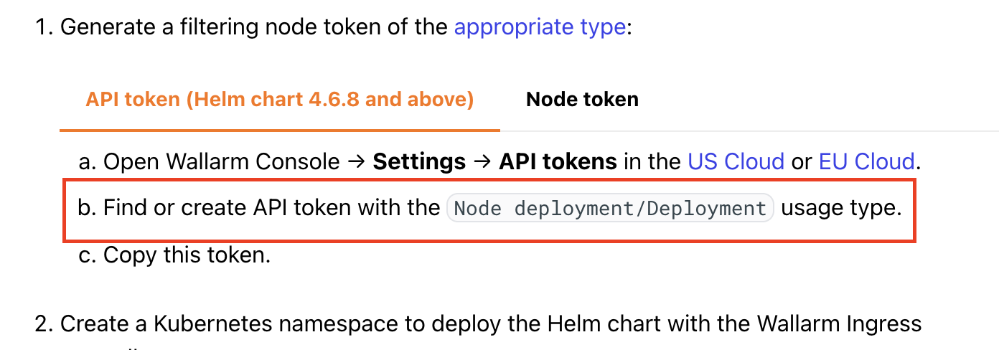
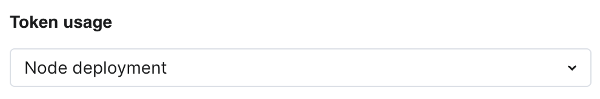
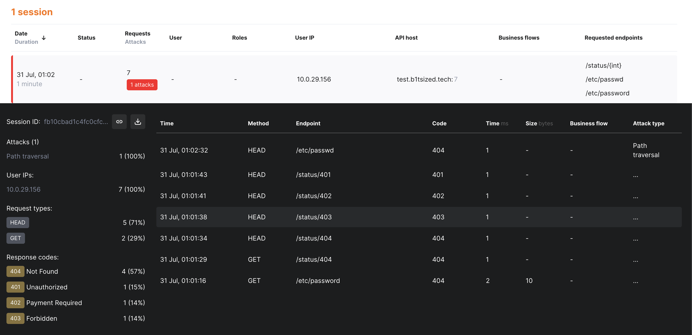
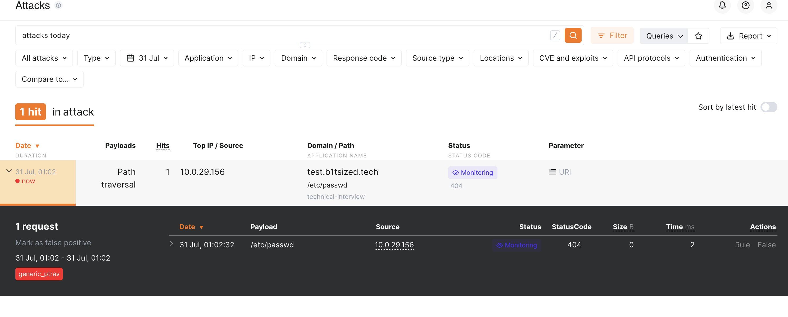

# Technical Evaluation Installation

I've chosen to use the [Wallarm Ingress Controller](https://docs.wallarm.com/admin-en/installation-kubernetes-en/#step-1-installing-the-wallarm-ingress-controller). Below I will outline the steps and notes I have from the installation.

## Installation

1. In the intial steps of the docs, it didn't drop me into the api tokens. It was the settings page. I had to navigate there manually. Option `b.` doesn't highlight  that you have to select `Node Deployemnt` in `Token Usage`. This wasn't a big deal, but wasn't clear.

    <div style="width: 60%; height: 60%">
    
    
    
    </div>
    <div style="width: 60%; height: 60%">
    
    
    
    </div>

2. I was able to install fairly easily. Below is an ouput of the logs. You can also review my [`values.yaml`](/helm_files/values.yaml).

    ```bash
    # jturner at prometheus.attlocal.net in ~/Documents/github.com [0:11:34]
    → kubectl get pods -A                                                                                                                <aws:b1tsized>
    NAMESPACE     NAME                           READY   STATUS    RESTARTS   AGE
    kube-system   aws-node-9ggld                 2/2     Running   0          29m
    kube-system   aws-node-w59nq                 2/2     Running   0          29m
    kube-system   coredns-845c8f77db-7hlxm       1/1     Running   0          28m
    kube-system   coredns-845c8f77db-qq66h       1/1     Running   0          28m
    kube-system   eks-pod-identity-agent-6zz4n   1/1     Running   0          29m
    kube-system   eks-pod-identity-agent-dv2rk   1/1     Running   0          29m
    kube-system   karpenter-57f888b858-gtbx9     1/1     Running   0          23m
    kube-system   karpenter-57f888b858-jjjdk     1/1     Running   0          23m
    kube-system   kube-proxy-45rvn               1/1     Running   0          28m
    kube-system   kube-proxy-8qll4               1/1     Running   0          28m
    wallarm       httpbin-69b6d9b5b5-ggcxw       1/1     Running   0          12s

    # jturner at prometheus.attlocal.net in ~/Documents/github.com [0:11:36]
    → kubectl get services -A                                                                                                            <aws:b1tsized>
    NAMESPACE     NAME                        TYPE        CLUSTER-IP      EXTERNAL-IP   PORT(S)                  AGE
    default       kubernetes                  ClusterIP   172.20.0.1      <none>        443/TCP                  39m
    kube-system   eks-extension-metrics-api   ClusterIP   172.20.73.91    <none>        443/TCP                  39m
    kube-system   karpenter                   ClusterIP   172.20.188.82   <none>        8080/TCP                 23m
    kube-system   kube-dns                    ClusterIP   172.20.0.10     <none>        53/UDP,53/TCP,9153/TCP   29m
    wallarm       httpbin                     ClusterIP   172.20.85.36    <none>        8080/TCP                 63s

    # jturner at prometheus.attlocal.net in ~/Documents/github.com [0:12:51]
    → kubectl get deployments -A                                                                                                         <aws:b1tsized>
    NAMESPACE     NAME        READY   UP-TO-DATE   AVAILABLE   AGE
    kube-system   coredns     2/2     2            2           29m
    kube-system   karpenter   2/2     2            2           24m
    wallarm       httpbin     1/1     1            1           96s

    # jturner at prometheus.attlocal.net in ~/Documents/github.com [0:12:59]
    → kubectl port-forward deployment/httpbin 8080:8080 -n wallarm                                                                       <aws:b1tsized>
    Forwarding from 127.0.0.1:8080 -> 8080
    Forwarding from [::1]:8080 -> 8080
    Handling connection for 8080
    Handling connection for 8080
    Handling connection for 8080
    Handling connection for 8080
    Handling connection for 8080
    Handling connection for 8080
    Handling connection for 8080
    Handling connection for 8080
    Handling connection for 8080
    Handling connection for 8080
    Handling connection for 8080
    Handling connection for 8080
    Handling connection for 8080
    Handling connection for 8080

    # jturner at prometheus.attlocal.net in ~/Documents/github.com [0:34:19]
    → helm repo add wallarm https://charts.wallarm.com                                                                                   <aws:b1tsized>
    "wallarm" has been added to your repositories

    # jturner at prometheus.attlocal.net in ~/Documents/github.com [0:34:21]
    → helm repo update wallarm                                                                                                           <aws:b1tsized>

    Hang tight while we grab the latest from your chart repositories...
    ...Successfully got an update from the "wallarm" chart repository
    Update Complete. ⎈Happy Helming!⎈

    # jturner at prometheus.attlocal.net in ~/Documents/github.com [0:34:50]
    → cd Wallarm-Solutions-Engineer-Challenge                                                                                            <aws:b1tsized>

    # jturner at prometheus.attlocal.net in ~/Documents/github.com/Wallarm-Solutions-Engineer-Challenge on git:main ✖︎ [0:34:55]
    → helm install --version 6.3.1 wallarm wallarm/wallarm-ingress -n wallarm -f values.yaml                                             <aws:b1tsized>
    NAME: wallarm
    LAST DEPLOYED: Thu Jul 31 00:36:37 2025
    NAMESPACE: wallarm
    STATUS: deployed
    REVISION: 1
    TEST SUITE: None
    NOTES:
    The ingress-nginx controller has been installed.
    It may take a few minutes for the load balancer IP to be available.
    You can watch the status by running 'kubectl get service --namespace wallarm wallarm-wallarm-ingress-controller --output wide --watch'

    An example Ingress that makes use of the controller:
    apiVersion: networking.k8s.io/v1
    kind: Ingress
    metadata:
        name: example
        namespace: foo
    spec:
        ingressClassName: nginx
        rules:
        - host: www.example.com
            http:
            paths:
                - pathType: Prefix
                backend:
                    service:
                    name: exampleService
                    port:
                        number: 80
                path: /
        # This section is only required if TLS is to be enabled for the Ingress
        tls:
        - hosts:
            - www.example.com
            secretName: example-tls

    If TLS is enabled for the Ingress, a Secret containing the certificate and key must also be provided:

    apiVersion: v1
    kind: Secret
    metadata:
        name: example-tls
        namespace: foo
    data:
        tls.crt: <base64 encoded cert>
        tls.key: <base64 encoded key>
    type: kubernetes.io/tls

    # jturner at prometheus.attlocal.net in ~/Documents/github.com/Wallarm-Solutions-Engineer-Challenge on git:main ✖︎ [0:36:52]
    → kubectl get service --namespace wallarm wallarm-wallarm-ingress-controller --output wide --watch                                   <aws:b1tsized>
    NAME                                 TYPE           CLUSTER-IP     EXTERNAL-IP                                                               PORT(S)                      AGE     SELECTOR
    wallarm-wallarm-ingress-controller   LoadBalancer   172.20.5.208   ac549b596e3a34ee6acbbd7550513eb5-2138899269.us-east-1.elb.amazonaws.com   80:32090/TCP,443:32562/TCP   2m58s   app.kubernetes.io/component=controller,app.kubernetes.io/instance=wallarm,app.kubernetes.io/name=wallarm-ingress
    ```

3. After the controller was set up I read the output about the ingress and was able to apply one. You can find the file [here](/helm_files/ingress.yaml). I was able to run the following.

    ```bash
    kubectl apply -f ingress.yaml -n wallarm
    ```

4. Below you can see me testing the api endpoint. I forgot how to do the host header, because it's been a bit where I had to forward that, but you can see I was able to get the responsed fairly quickly. 

    ```bash 
    # jturner at prometheus.attlocal.net in ~/Documents/github.com/Wallarm-Solutions-Engineer-Challenge on git:main ✖︎ [0:51:50]
    → kubectl annotate ingress wallarm-ingress -n wallarm nginx.ingress.kubernetes.io/wallarm-mode=monitoring                            <aws:b1tsized>
    ingress.networking.k8s.io/wallarm-ingress annotated

    # jturner at prometheus.attlocal.net in ~/Documents/github.com/Wallarm-Solutions-Engineer-Challenge on git:main ✖︎ [0:53:16]
    → kubectl annotate ingress wallarm-ingress -n wallarm nginx.ingress.kubernetes.io/wallarm-application="1010"                         <aws:b1tsized>
    ingress.networking.k8s.io/wallarm-ingress annotated

    # jturner at prometheus.attlocal.net in ~/Documents/github.com/Wallarm-Solutions-Engineer-Challenge on git:main ✖︎ [0:55:01]
    → kubectl get pods -n wallarm -l app.kubernetes.io/name=wallarm-ingress                                                              <aws:b1tsized>
    NAME                                                              READY   STATUS    RESTARTS   AGE
    wallarm-wallarm-ingress-controller-68745d88cb-8727q               3/3     Running   0          18m
    wallarm-wallarm-ingress-controller-wallarm-wstore-767b686ckt6bv   3/3     Running   0          18m

    # jturner at prometheus.attlocal.net in ~/Documents/github.com/Wallarm-Solutions-Engineer-Challenge on git:main ✖︎ [0:55:35]
    → kubectl get ingress -n wallarm                                                                                                     <aws:b1tsized>
    NAME              CLASS   HOSTS                ADDRESS                                                                   PORTS   AGE
    wallarm-ingress   nginx   test.b1tsized.tech   ac549b596e3a34ee6acbbd7550513eb5-2138899269.us-east-1.elb.amazonaws.com   80      4m23s

    # jturner at prometheus.attlocal.net in ~/Documents/github.com/Wallarm-Solutions-Engineer-Challenge on git:main ✖︎ [0:55:53]
    → curl ac549b596e3a34ee6acbbd7550513eb5-2138899269.us-east-1.elb.amazonaws.com/etc/passwd                                            <aws:b1tsized>
    <html>
    <head><title>404 Not Found</title></head>
    <body>
    <center><h1>404 Not Found</h1></center>
    <hr><center>nginx</center>
    </body>
    </html>

    # jturner at prometheus.attlocal.net in ~/Documents/github.com/Wallarm-Solutions-Engineer-Challenge on git:main ✖︎ [0:56:27]
    → curl http://ac549b596e3a34ee6acbbd7550513eb5-2138899269.us-east-1.elb.amazonaws.com/etc/passwd                                     <aws:b1tsized>
    <html>
    <head><title>404 Not Found</title></head>
    <body>
    <center><h1>404 Not Found</h1></center>
    <hr><center>nginx</center>
    </body>
    </html>

    # jturner at prometheus.attlocal.net in ~/Documents/github.com/Wallarm-Solutions-Engineer-Challenge on git:main ✖︎ [0:56:38]
    → curl --resolve 'ac549b596e3a34ee6acbbd7550513eb5-2138899269.us-east-1.elb.amazonaws.com' http://test.b1tsized.tech/etc/password    <aws:b1tsized>
    curl: (49) Couldn't parse CURLOPT_RESOLVE entry 'ac549b596e3a34ee6acbbd7550513eb5-2138899269.us-east-1.elb.amazonaws.com'

    # jturner at prometheus.attlocal.net in ~/Documents/github.com/Wallarm-Solutions-Engineer-Challenge on git:main ✖︎ [1:00:22]
    → curl -H 'Host: test.b1tsized.tech' ac549b596e3a34ee6acbbd7550513eb5-2138899269.us-east-1.elb.amazonaws.com/etc/password            <aws:b1tsized>
    Not Found

    # jturner at prometheus.attlocal.net in ~/Documents/github.com/Wallarm-Solutions-Engineer-Challenge on git:main ✖︎ [1:01:16]
    → curl -H 'Host: test.b1tsized.tech' ac549b596e3a34ee6acbbd7550513eb5-2138899269.us-east-1.elb.amazonaws.com/status/404              <aws:b1tsized>

    # jturner at prometheus.attlocal.net in ~/Documents/github.com/Wallarm-Solutions-Engineer-Challenge on git:main ✖︎ [1:01:29]
    → curl -I -H 'Host: test.b1tsized.tech' ac549b596e3a34ee6acbbd7550513eb5-2138899269.us-east-1.elb.amazonaws.com/status/404           <aws:b1tsized>
    HTTP/1.1 404 Not Found
    Date: Thu, 31 Jul 2025 05:01:34 GMT
    Connection: keep-alive
    Access-Control-Allow-Credentials: true
    Access-Control-Allow-Origin: *


    # jturner at prometheus.attlocal.net in ~/Documents/github.com/Wallarm-Solutions-Engineer-Challenge on git:main ✖︎ [1:01:34]
    → curl -I -H 'Host: test.b1tsized.tech' ac549b596e3a34ee6acbbd7550513eb5-2138899269.us-east-1.elb.amazonaws.com/status/403           <aws:b1tsized>
    HTTP/1.1 403 Forbidden
    Date: Thu, 31 Jul 2025 05:01:38 GMT
    Connection: keep-alive
    Access-Control-Allow-Credentials: true
    Access-Control-Allow-Origin: *


    # jturner at prometheus.attlocal.net in ~/Documents/github.com/Wallarm-Solutions-Engineer-Challenge on git:main ✖︎ [1:01:38]
    → curl -I -H 'Host: test.b1tsized.tech' ac549b596e3a34ee6acbbd7550513eb5-2138899269.us-east-1.elb.amazonaws.com/status/402           <aws:b1tsized>
    HTTP/1.1 402 Payment Required
    Date: Thu, 31 Jul 2025 05:01:41 GMT
    Connection: keep-alive
    Access-Control-Allow-Credentials: true
    Access-Control-Allow-Origin: *
    X-More-Info: http://vimeo.com/22053820


    # jturner at prometheus.attlocal.net in ~/Documents/github.com/Wallarm-Solutions-Engineer-Challenge on git:main ✖︎ [1:01:41]
    → curl -I -H 'Host: test.b1tsized.tech' ac549b596e3a34ee6acbbd7550513eb5-2138899269.us-east-1.elb.amazonaws.com/status/401           <aws:b1tsized>
    HTTP/1.1 401 Unauthorized
    Date: Thu, 31 Jul 2025 05:01:43 GMT
    Connection: keep-alive
    Access-Control-Allow-Credentials: true
    Access-Control-Allow-Origin: *
    Www-Authenticate: Basic realm="Fake Realm"


    # jturner at prometheus.attlocal.net in ~/Documents/github.com/Wallarm-Solutions-Engineer-Challenge on git:main ✖︎ [1:01:43]
    → curl -I -H 'Host: test.b1tsized.tech' ac549b596e3a34ee6acbbd7550513eb5-2138899269.us-east-1.elb.amazonaws.com/etc/passwd           <aws:b1tsized>
    HTTP/1.1 404 Not Found
    Date: Thu, 31 Jul 2025 05:02:32 GMT
    Content-Type: text/plain; charset=utf-8
    Connection: keep-alive
    Access-Control-Allow-Credentials: true
    Access-Control-Allow-Origin: *
    X-Content-Type-Options: nosniff
    ```

5. I was able to see the sessions and attack in the UI.

    <div style="width: 60%; height: 60%">
    
    
    
    </div>
    <div style="width: 60%; height: 60%">
    
    
    
    </div>