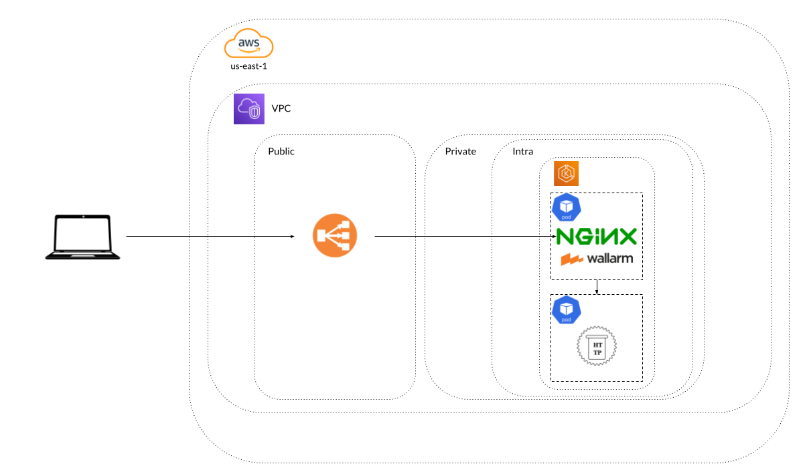

# Wallarm Solutions Engineer Technical Evaluation

## 📌 Overview

Below I've update this repo to reflect my solution for the Wallarm Technical Evaluation. For each section I will give my reasoning and break out to the other docs for each step of the process. I've also included this diagram overviewing my deployment solution with an EKS cluster and NGINX Ingress Filter set up.

    

    

---

## 🚀 Task Breakdown

### Environement Setup

I decided with my deployment I would deploy within an EKS cluster. I did so by creating terraform that would allow me to spin up and spin down the cluster and make it more programatic if I needed to troubleshoot anything.

You can all the relevant files and steps I took in the [setup portion](/SETUP.md). The code is pretty straight forward. Using the EKS and VPC Terraform Modules I created a whole new cluster in a new VPC with all the relevant security rules. 

I also deployed `Karpenter` in case I needed to scale out workers for management. Not necessary, but if I were to scale up replicas for instance would be easier. I also deployed an `HTTPbin` container within the cluster to be able to put the `NGINX` filter in front of it.

### 1️⃣ Deploy a Wallarm Filtering Node

Since, I decided to install with the NGINX filter I followed the instructions within the [Wallarm documentation](https://docs.wallarm.com/admin-en/installation-kubernetes-en/). You can find all the relevant steps for set up within the [installation markdown](/INSTALL.MD). You can find the `yaml` files used for Helm in [helm_files](/helm_files/). I also configured the Ingress for my HTTPbin using the [`ingress.yaml`](/helm_files/ingress.yaml).

### 2️⃣ Set Up a Backend Origin

This was completed in my initial set up with my terraform deployment.

### 3️⃣ Generate Traffic Using GoTestWAF

You can find all relevant steps in [WAF test](/WAFTEST.md) section. I added the reports [here](/reports/).

### 4️⃣ Document Your Process

I've now uploaded and shared all files for your review in the sections above. Thanks for the opportunity. I look forward to hearing from you soon. 

